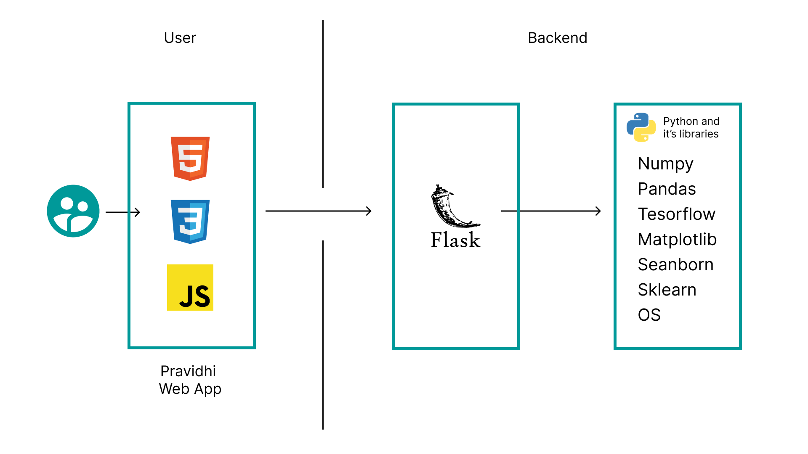
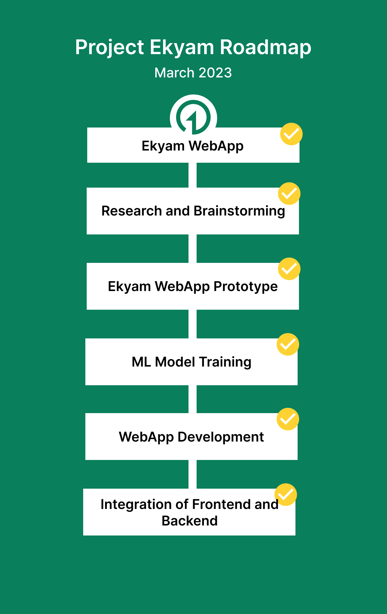

 

# Team-Nidan/Project-Ekyam

- [Project summary](#project-summary)
  - [The issue we are hoping to solve](#the-issue-we-are-hoping-to-solve)
  - [How our technology solution can help](#how-our-technology-solution-can-help)
  - [Our idea](#our-idea)
- [Technology implementation](#technology-implementation)
  - [Solution architecture](#solution-architecture)
- [Presentation materials](#presentation-materials)
  - [Solution demo video](#solution-demo-video)
  - [Project development roadmap](#project-development-roadmap)
- [Additional details](#additional-details)
  - [How to run the project](#how-to-run-the-project)
  - [Live demo](#live-demo)
- [About this template](#about-this-template)
  - [Contributing](#contributing)
  - [Versioning](#versioning)
  - [Authors](#authors)
  - [License](#license)
  - [Acknowledgments](#acknowledgments)

## Project summary

### The issue we are hoping to solve

REPLACE THIS SENTENCE with a short description, 2-3 sentences in length, of the specific sustainability problem your solution is meant to address.

### How our technology solution can help

Waste Management through ML/DL and Data Science

### Our idea

Waste management is a global issue which ineeds to be solved at grassroot level. Our main aim in this project is to segregate waste through machine learning and deep learning models.
More ever we also guide the users in the possible ways to recycle their waste efficiently and ways to earn through it.
We have trained model with 92% to 94% accuracy which makes it more reliable.
In this project we have made feature where the user can upload the image of the waste to classify it into organic waste and recyclable waste.
We have also made a data analysis of Singapore municipal Coorporation which is one of the best waste management systems in the world to educate and give an idea to users how they can take steps to make their city clean and green.
We have made a feature where users can fill the data and know the amount they can generate money through the waste.

## Technology implementation

### Solution architecture

Diagram and step-by-step description of the flow of our solution:

1. The user navigates to the site and upload images for waste segregation.
2. The user fills the form to see how they can earn through proper waste management.
3. At the end of every result the user gets management tips to earn money and dispose waste effectively.

## Presentation materials

### Solution demo video

### Project development roadmap

The project currently does the following things.

- Case Study of Worlds cleanest Country
- Generating money through Waste Management
- Segregating waste to recyclable and Organic
- Segregating waste to different type
- Predicting the crop to grown in order to reduce the waste generated through farmlands

In the future we plan to...
- Bottle Segregation to different materials (trained through Yolo)
- Storing users data to database to show them a dasboard of their trackrecord
- Promoting awareness by providing them with more options to generate money
- Doing clustering of neighbourhoods to provide them with more waste management tips according to their clusters
See below for our proposed schedule on next steps after Call for Code 2023 submission.

## Additional details

### How to run the project

INSTRUCTIONS: clone the git repositiry in your local system then from terminal run the cmd python app.py .

### Live demo

You can find a running system to test at...

---

